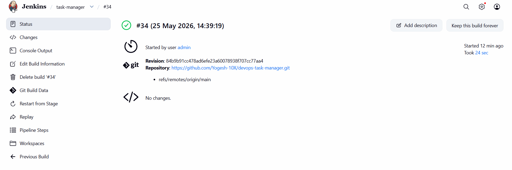
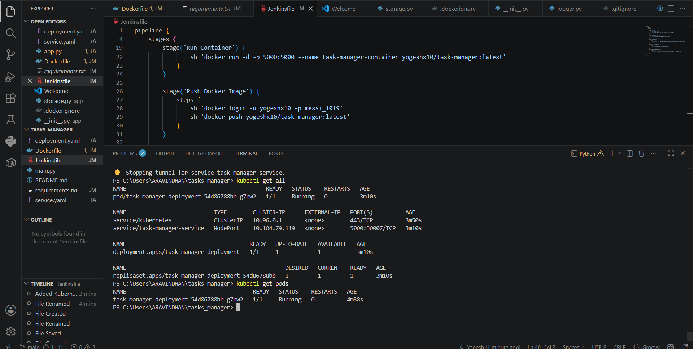
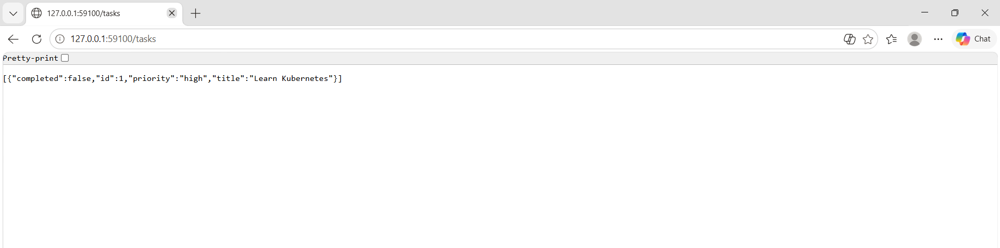

# DevOps Task Manager

A Python-based Task Manager REST API built with **Flask** and deployed using a complete **DevOps CI/CD pipeline** with Docker, Jenkins, and Kubernetes (Minikube).

---

## Features

- Create tasks
- View tasks
- Delete tasks
- Mark tasks as completed
- Priority support
- JSON-based task storage
- REST API with Flask
- Docker containerization
- Jenkins CI/CD pipeline
- Kubernetes deployment

---

## Tech Stack

- Python
- Flask
- Docker
- Jenkins
- Kubernetes (Minikube)
- Git & GitHub

---

## Run Locally

```bash
python app.py
```

Application runs on:

```
http://localhost:5000
```

---

## Docker

Build the image:

```bash
docker build -t yogeshx10/task-manager:latest .
```

Run the container:

```bash
docker run -d -p 5000:5000 --name task-manager-container yogeshx10/task-manager:latest
```

---

## Kubernetes

Deploy the application:

```bash
kubectl apply -f deployment.yaml
kubectl apply -f service.yaml
```

View resources:

```bash
kubectl get pods
kubectl get services
```

Access the application:

```bash
minikube service task-manager-service
```

---

## API Endpoints

| Method | Endpoint | Description |
|--------|----------|-------------|
| GET | `/` | API status |
| GET | `/tasks` | List all tasks |
| POST | `/tasks` | Create a task |
| PUT | `/tasks/<id>/complete` | Mark task as completed |
| DELETE | `/tasks/<id>` | Delete a task |

---

## Screenshots

### Jenkins Pipeline Success



### Kubernetes Deployment



### API Response

